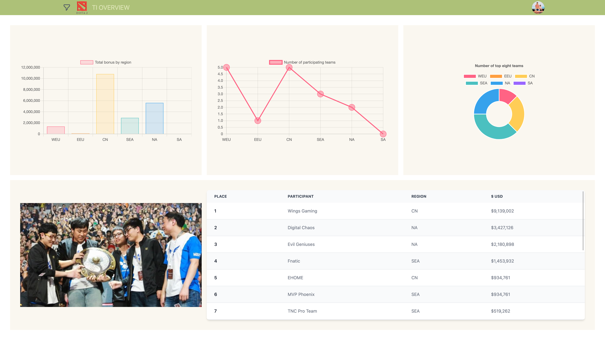

# ACE Digital Assignment



## Project URL

[https://ace-digital-assignment.deno.dev/](https://ace-digital-assignment.deno.dev/)

## Features

- Login by github OAuth2
- Overview all annual editions of all Dota2 TI statistics

## Steps

### 1. Install Deno

This project uses Deno! Install for your OS by following the instructions
[here](https://deno.land/#installation)

### 2. Init environment Variables

Copy the .env.sample file into .env

```sh
cp .env.sample .env
```

### 3. Init database

- Get your database URL link from `railway` or `supabase` or any other database
  provider

- Paste the link to the `DATABASE_URL` field in your `.env` file

- Create the database schema

```sh
deno task generate:schema
```

- Generate a Prisma Client for Data Proxy

```sh
deno task generate:client
```

- Follow the instruction of the prisma official website
  [Deploy to Deno Deploy](https://www.prisma.io/docs/guides/deployment/deployment-guides/deploying-to-deno-deploy)
  get the Prisma connection URL: `prisma://`

- Set the Data Proxy Connection string in your environment

- Init data to your database

  ```sh
  deno task generate:data
  ```

## Start the server

Start the project (this will install dependencies on first run):

```
deno task start
```

This will watch the project directory and restart as necessary.

## Frameworks

- Backend Framework
  - [Deno + Fresh](https://fresh.deno.dev/)

- Database Access
  - [Prisma](https://www.prisma.io/)

- OAuth 2
  - [DenoGrant](https://github.com/w3cj/deno_grant)

- Signed Cookies
  - [Squishy Cookies](https://github.com/omar2205/squishy_cookies)

- UI framework
  - [twind](https://twind.dev/)
  - [flowbite](https://flowbite.com/)
